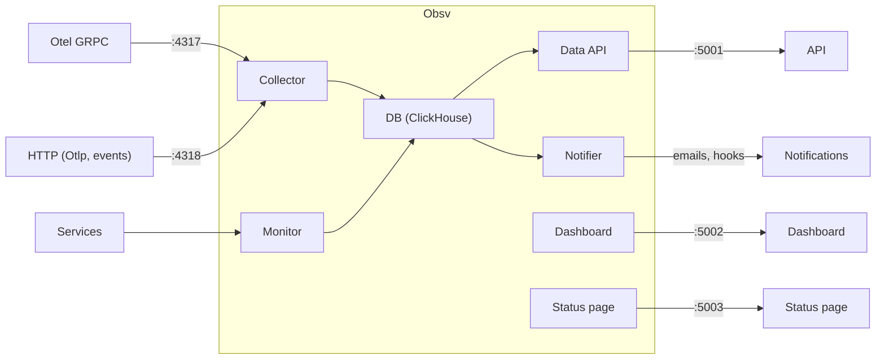

# obsv

Simple Observability Platform

## Deployment

All services are packaged as an all-in-one executable, which can be configured 
to serve only specific services (deployed separately).
```sh
cargo run --bin osv
```

## Overview



## Repo organization

- `obsv-core`: core structures and utilities
- `obsv-collect`: collector service
- `obsv-monitor`: monitoring service
- `obsv-api`: data API service
- `obsv-notify`: notification service
- `obsv-dash`: dashboard service
- `obsv-status`: status page service
- `obsv-bin`: executable
- `lib/**`: shared libraries

## Similar tools

- [Jaeger](https://github.com/teletrace/teletrace): tracing collector and dashboard
- [Prometheus](https://prometheus.io/): metrics and alerting toolkit
- [teletrace](https://github.com/teletrace/teletrace): tracing collector and dashboard (ElasticSearch DB + Collector/Server).
- [Vigil](https://github.com/valeriansaliou/vigil): monitors, alerts, status page
- [QRYN](https://github.com/metrico/qryn): observability platform
- ...
