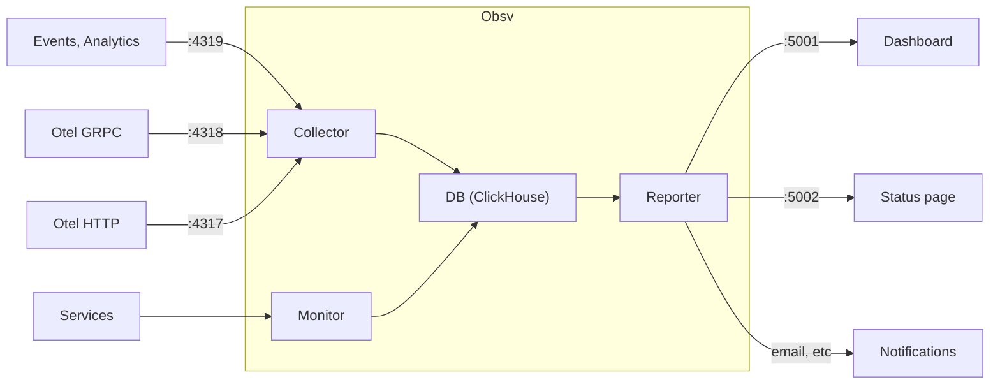

# obsv

Super Simple Observability Platform

```sh
simple install script
```

## Overview



## Repo organization

- `obsv-collect`: server to collect data (Otel)
- `obsv-monitor`: service to monitor services
- `obsv-store`: internal storage
- `obsv-report`: server to serve data, pages, and notify
- `lib/**`: shared libraries

## Similar tools

- [Jaeger](https://github.com/teletrace/teletrace): tracing collector and dashboard
- [Prometheus](https://prometheus.io/): metrics and alerting toolkit
- [teletrace](https://github.com/teletrace/teletrace): tracing collector and dashboard (ElasticSearch DB + Collector/Server).
- [Vigil](https://github.com/valeriansaliou/vigil): monitors, alerts, status page
- [QRYN](https://github.com/metrico/qryn): observability platform
- ...

### Opentelemetry

#### Signals

##### Traces

A `Trace` is a collection of `Spans` (~unit of work for tracing), grouped by trace_id. The `TraceContext` allows to correlates the spans with each other and with a trace.

On the app side,

- the `TracerProvider` provides tracers
- a `Tracer` crates `Spans`
- a `TraceExporter` exports the traces

```json
{
    "name": "Hello-Greetings",
    "context": {
        "trace_id": "0x5b8aa5a2d2c872e8321cf37308d69df2",
        "span_id": "0x5fb397be34d26b51",
    },
    "parent_id": "0x051581bf3cb55c13",
    "start_time": "2022-04-29T18:52:58.114304Z",
    "end_time": "2022-04-29T22:52:58.114561Z",
    "attributes": {
        "http.route": "some_route1"
    },
    "events": [
        {
            "name": "hey there!",
            "timestamp": "2022-04-29T18:52:58.114561Z",
            "attributes": {
                "event_attributes": 1
            }
        },
        {
            "name": "bye now!",
            "timestamp": "2022-04-29T18:52:58.114585Z",
            "attributes": {
                "event_attributes": 1
            }
        }
    ],
}
{
    "name": "Hello-Salutations",
    "context": {
        "trace_id": "0x5b8aa5a2d2c872e8321cf37308d69df2",
        "span_id": "0x93564f51e1abe1c2",
    },
    "parent_id": "0x051581bf3cb55c13",
    "start_time": "2022-04-29T18:52:58.114492Z",
    "end_time": "2022-04-29T18:52:58.114631Z",
    "attributes": {
        "http.route": "some_route2"
    },
    "events": [
        {
            "name": "hey there!",
            "timestamp": "2022-04-29T18:52:58.114561Z",
            "attributes": {
                "event_attributes": 1
            }
        }
    ],
}
{
    "name": "Hello",
    "context": {
        "trace_id": "0x5b8aa5a2d2c872e8321cf37308d69df2",
        "span_id": "0x051581bf3cb55c13",
    },
    "parent_id": null,
    "start_time": "2022-04-29T18:52:58.114201Z",
    "end_time": "2022-04-29T18:52:58.114687Z",
    "attributes": {
        "http.route": "some_route3"
    },
    "events": [
        {
            "name": "Gut Tag!",
            "timestamp": "2022-04-29T18:52:58.114561Z",
            "attributes": {
                "event_attributes": 1
            }
        }
    ],
}
```

##### Metrics

A `Metric` captures an app metric, and can be of type: counter, async counter, up/down counter, async up/down counter, gauge, histogram. Those are aggregate measures.

##### Logs

A `Log` is a timestamped text record.

#### Collector

The collector:

- receives incoming data: `Receiver`
- processes the data: `Processor`
- forwards the data to a backend: `Exporter`

Deploy it

```sh
docker run otel/opentelemetry-collector
```

The collector can be deployed as an agent (sidecar), or gateway.

Config example: `otel_coll_config.yaml`:

```yaml
receivers:
  otlp:
    protocols:
      grpc:
      http:

processors:
  batch:

exporters:
  otlp:
    endpoint: otelcol:4317

extensions:
  health_check:
  pprof:
  zpages:

service:
  extensions: [health_check, pprof, zpages]
  pipelines:
    traces:
      receivers: [otlp]
      processors: [batch]
      exporters: [otlp]
    metrics:
      receivers: [otlp]
      processors: [batch]
      exporters: [otlp]
    logs:
      receivers: [otlp]
      processors: [batch]
      exporters: [otlp]
```
